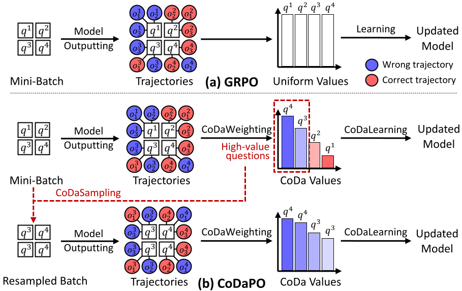

<h1 align="center">
<b>[Confidence and Difficulty-adaptive Policy Optimization](https://arxiv.org/abs/2606.07950)</b>
</h1>

RL with verifiable rewards can substantially improve LLM reasoning, yet standard GRPO-style training often treats *easy*, *hard*, and *learnable* questions alike through uniform sampling and weighting, leading to inefficient compute allocation. We study GRPO by tracking token log-probabilities, group-normalized advantages, and the induced token-level update weights. This reveals three recurring dynamics as training proceeds: (1) *confidence inflation*, (2) *advantage contraction*, and (3) *hierarchical convergence*. These findings suggest that the utility of each update depends strongly on both question difficulty and the model's current competence. Motivated by this, we propose Confidence and Difficulty-adaptive Policy Optimization (CoDaPO), which assigns each question a bounded value from rollout confidence and empirical difficulty. CoDaPO then uses this value to reweight policy updates and resample high-value *learnable* questions within minibatches, increasing discovery within the learnable band under a fixed compute budget. Across seven benchmarks, CoDaPO consistently improves accuracy over existing RL methods.


## ✨ Key features

<p align="center">
  
</p>

CoDaPO is a **data-centric** and **model-adaptive** framework for RL post-training: it plugs into standard RL objectives by reweighting policy updates and biasing sampling toward the questions most worth learning from. The framework has three components, each described below with its code path; see the paper for derivations and ablations.

### CoDaWeighting
For each question, CoDaPO computes a **CoDaValue** $v_q$ that reflects how informative the question still is for further optimization:

$$v_q = V(c_q, d_q) = V_c(c_q) V_d(d_q).$$

It combines two signals: the rollout confidence $c_q$ (passed through a linear $V_c$) and the empirical difficulty $d_q$ (passed through a U-shaped $V_d$, which peaks in the middle). CoDaPO then scales each sample's group-normalized advantage by $v_q$, so saturated easy questions and hopeless hard ones contribute little, while the *learnable* mid-difficulty band gets up-weighted.

- Code: [`compute_codapo_advantage`](alphaapollo/core/generation/verl/trainer/ppo/core_algos.py).

### CoDaSampling
After CoDaWeighting scores every question, CoDaSampling picks the top-K highest-scoring ones in each minibatch and runs extra rollouts on each. These extra trials concentrate compute on questions where a correct trajectory is rare but still reachable, raising the chance the model actually finds one.

- Knobs: `algorithm.codapo.percentile` (top-K cutoff, default `0.75` keeps top 25%) and `algorithm.codapo.repeat_count` (i.e. $m$, default `4`).
- Code: [`codapo/ray_trainer.py`](codapo/ray_trainer.py) (top-K on even step, batch reorganization on odd step).

### CoDaLearning
CoDaLearning runs **two separate policy updates** per duplicated batch: a batch-wide step on the original minibatch $B$ (broad coverage with CoDaWeighting), followed by a focused step on the CoDaSampling subset $S$ (focused refinement on the learnable band). Every question contributes once via $B$; high-value questions contribute a second time via $S$.

- Knob: `algorithm.adv_estimator=codapo` (enables the pipeline).
- Code: [`codapo/ray_trainer.py`](codapo/ray_trainer.py) (batch duplication and even/odd dispatch).

## 🛠️ Installation

```bash
conda create -n codapo python==3.12 -y
conda activate codapo

git clone https://github.com/tmlr-group/CoDaPO.git
cd CoDaPO

bash installation.sh
```


## 🚀 Quick start

### 1. Prepare datasets *(optional)*

This script downloads and preprocesses the exact datasets used in the paper: MATH for training, plus the seven validation benchmarks evaluated in the paper (MATH-500, AIME24, AIME25, AMC23, OlympiadBench, MinervaMath, GSM8K), each repeated 32×.

```bash
bash codapo/examples/prepare_datasets.sh
```

Edit `test_data_sources` and `test_repeats` in the script to swap in different validation benchmarks or change their repeat counts. Outputs land in `$HOME/data/...`.

### 2. Train with CoDaPO

The full reference recipe (Qwen2.5-Math-1.5B on MATH, evaluated on MATH500):

```bash
bash codapo/examples/run_codapo_Qwen2.5-Math-1.5B_MATH.sh
```

Note that you should comment out the `prepare_merged_validation_data` call in this script if you want to keep step 1's validation set.

### 3. Combine CoDaPO with other RL methods *(optional)*

Since CoDaPO is a data-centric layer (per-question reweighting + value-guided resampling), it composes orthogonally with other modifications to the base RL objective. The recipe below pairs CoDaPO with DAPO.

```bash
bash codapo/examples/run_codapo_dapo_Qwen2.5-Math-1.5B_MATH.sh
```


## 📁 Code structure

```text
CoDaPO/
├── codapo/                          # CoDaPO trainer (this work)
│   ├── main_ppo.py                  # Hydra entrypoint; reuses ppo_trainer.yaml
│   ├── ray_trainer.py               # Modified Ray PPO trainer with CoDaWeighting + CoDaSampling
│   └── examples/                    # Reference shell recipes
│       
└── alphaapollo/                     # Upstream framework (alphaapollo)
    ├── data_preprocess/             # Dataset preparation scripts
    └── core/
        ├── generation/              # Rollout + verl trainer configs
        ├── tools/                   # python_code, rag, ...
        └── environments/            # informal_math_training, prompts, memory, ...
```


## 🙏 Acknowledgement
CoDaPO is built on top of [AlphaApollo](https://github.com/tmlr-group/AlphaApollo), [verl](https://github.com/volcengine/verl), and [verl-agent](https://github.com/langfengQ/verl-agent/tree/master). We sincerely thank the contributors of these projects for their valuable work and support.


## 📚 Cite
If you find **CoDaPO** useful in your research, please consider citing our work:

```
@inproceedings{zhou2026codapo,
    title={The Easy, the Hard, and the Learnable: Confidence and Difficulty\nobreakdash-Adaptive Policy Optimization for {LLM} Reasoning},
    author={Zhanke Zhou and Xiangyu Lu and Chentao Cao and Brando Miranda and Tongliang Liu and Bo Han and Sanmi Koyejo},
    booktitle={ICML},
    year={2026},
}
```
