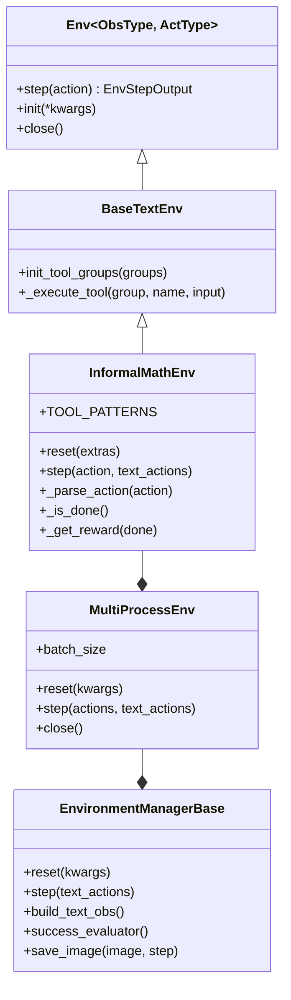
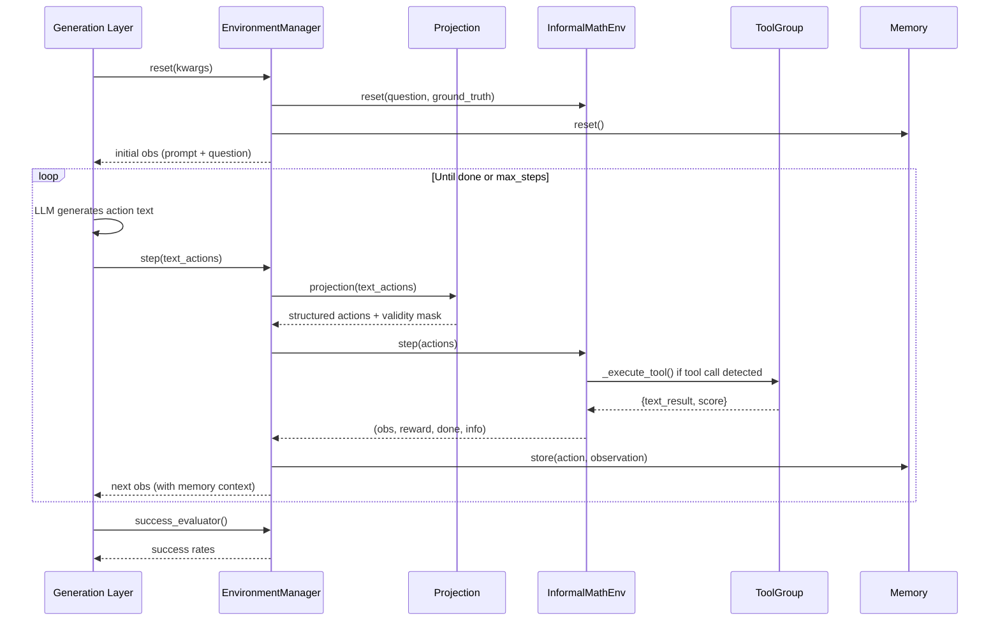

# Agent System

AlphaApollo is built around an **environment-driven, multi-turn agentic reasoning system** that follows the Gym-style interface pattern. At its core, a language model interacts with a structured environment over multiple turns: at each step the model produces an action (potentially including tool calls), the environment executes it, returns an observation, and the loop continues until the problem is solved or a budget is exhausted.

## Architecture Overview

The system is organized in a layered hierarchy, from the lowest-level abstraction up to the orchestration layer:



Each layer adds a well-defined concern:

| Layer                  | Responsibility                                                         |
| ---------------------- | ---------------------------------------------------------------------- |
| `Env`                | Abstract step / reset / close interface                                |
| `BaseTextEnv`        | Tool group management and tool dispatch                                |
| `InformalMathEnv`    | Reward computation, action parsing, tool pattern matching              |
| `MultiProcessEnv`    | Thread-pool parallelism over a batch of environments                   |
| `EnvironmentManager` | Prompt construction, memory read/write, projection, success evaluation |
| `Generation`         | Tokenization, model inference integration (verl / evolving)            |

:::info Source file mapping
- `Env` → `core/environments/informal_math_training/core.py`
- `BaseTextEnv` → `core/environments/informal_math_training/base_text_env.py`
- `InformalMathEnv` → `core/environments/informal_math_training/env.py`
- `MultiProcessEnv` → `core/environments/informal_math_training/envs.py`
- `EnvironmentManagerBase` → `core/environments/base.py`
- Training/Evolving Managers → `core/environments/env_manager.py`
:::

## Core Abstraction: Environment

### Env — the Gym-style base

`alphaapollo/core/environments/informal_math_training/core.py` defines the minimal `Env[ObsType, ActType]` generic class:

- `step(action)` → `EnvStepOutput` containing `observations`, `reward`, `done`, `metadata`.
- `init(**kwargs)` — initialize the environment.
- `close()` — clean up resources.

### BaseTextEnv — tool-aware text environment

`alphaapollo/core/environments/informal_math_training/base_text_env.py` extends `Env[str, str]` with tool management:

- `init_tool_groups(tool_groups)` — registers one or more `ToolGroup` instances.
- `_execute_tool(group_name, tool_name, tool_input)` — dispatches a tool call by looking up the correct group and invoking the named tool.
- Returns `BaseTextEnvStepOutput` with an additional `postprocessed_action` field.

### InformalMathEnv — domain environment

`alphaapollo/core/environments/informal_math_training/env.py` implements the concrete math-solving environment:

- **Tool patterns** — `TOOL_PATTERNS` is an extensible list of `(tool_name, regex_pattern)` tuples covering `python_code` and `local_rag`.
- **Reset** — sets the question, ground truth, and max steps; initializes the chat history.
- **Step** — parses the model's action with `_parse_action()`, checks termination via `_is_done()`, executes matched tools, and returns observations.
- **Reward** — `_get_reward()` calls `compute_score()` on termination (binary 0/1); intermediate steps yield no reward.
- **RAG hint** — if a `python_code` execution fails (score = 0) and RAG is enabled, the environment appends a suggestion to try the RAG tool.

## Vectorized Parallel Environments

`alphaapollo/core/environments/informal_math_training/envs.py` provides `InformalMathTrainingMultiProcessEnv`, which runs multiple environment instances in parallel using a `ThreadPoolExecutor`:

- `batch_size = env_num × group_n` — total number of concurrent environments.
- `reset(kwargs)` / `step(actions)` — broadcast operations across all instances with automatic padding and `valid_mask` tracking.
- `close()` — shuts down the thread pool and event loops.

A corresponding `InformalMathEvolvingMultiProcessEnv` exists for the evolution workflow with additional support for `policy_solution` and `previous_solutions` fields.

## Environment Manager

The environment manager is the high-level orchestrator that wires together prompts, memory, projection, and the vectorized environment.

### EnvironmentManagerBase

Defined in `alphaapollo/core/environments/base.py`, this is the abstract orchestrator:

| Method | Description |
| --- | --- |
| `reset(kwargs)` | Resets all environments, returns observation dict `{text, image, anchor}` |
| `step(text_actions)` | Runs projection → env step → returns `(obs, rewards, dones, infos)` |
| `build_text_obs()` | Constructs the text observation (abstract, implemented by subclasses) |
| `success_evaluator(**kwargs)` | Checks `info['won']` across a batch to compute success rates |
| `save_image(image, step)` | Debug utility: saves an observation image to `images/<env_name>/step{N}.png` |
| `close()` | Delegates to `self.envs.close()` |

Helper: `to_numpy(data)` converts `torch.Tensor`, lists, and scalars to `np.ndarray` — used extensively in `step()` and `success_evaluator()`.

### Training Environment Manager

`InformalMathTrainingEnvironmentManager` in `alphaapollo/core/environments/env_manager.py`:

- Selects the memory type based on `config.env.informal_math.memory_type`:
  - `"score"` → `EvolvingMemory`
  - `"ndimensional"` → `NDimensionalMemory`
  - `"simple"` → `SimpleMemory`
- Reads `execution_mode` from `config.env.informal_math.execution_mode` (default: `"agentic"`).
- On `reset()`: resets the environment, initializes memory, and constructs a prompt-augmented text observation via `get_policy_training_prompt()`.
- On `step()`: runs projection → environment step → stores the transition in memory → builds a new observation.

### Evolving Environment Manager

`InformalMathEvolvingEnvironmentManager` adds:

- **Verifier mode** — distinguishes policy and verifier roles, selecting prompts via `get_policy_prompt()` or `get_verifier_prompt()`.
- **Previous solutions** — injects prior solutions from memory into the prompt.
- **Force done** — terminates on empty actions or `<report>` tags.
- **Action sanitization** — `_sanitize_action_for_memory()` cleans invalid actions before storing.
- **Per-source tracking** — `_process_batch()` computes success rates grouped by `data_source`.

### Factory

`make_envs(config)` in `env_manager.py` is the entry point that instantiates the correct environment manager based on `config.env.env_name`. Currently supported values:

| `env_name` (case-insensitive match) | Manager Class |
| --- | --- |
| `informal_math_training` | `InformalMathTrainingEnvironmentManager` |
| `informal_math_evolving` | `InformalMathEvolvingEnvironmentManager` |

The factory also reads `config.env.rollout.n` (the `group_n` parameter) to determine the number of rollout groups per environment.

:::tip Adding new environments
To add support for a new domain, add an `elif` branch in `make_envs()`. See [Adding a New Environment](../contribution/new-environment.md) for the full guide.
:::

### Utility Functions

`env_manager.py` also exports two helper functions:

| Function | Description |
| --- | --- |
| `parse_gamefile(infos)` | Extracts game file paths from environment info dicts |
| `set_gamefile(infos, gamefile)` | Injects a game file path into environment info dicts |

## Projection

The projection layer (`alphaapollo/core/environments/informal_math_training/projection.py`) maps raw LLM output into a structured action:

- **Supported tool tokens**: `python_code`, `local_rag`.
- **Priority**: `<answer>` tags take precedence over tool-call tags.
- **Post-processing**: `_postprocess_action()` truncates at the first matching close tag to prevent hallucinated continuations.
- **Validity checks**:
  - An action with both a tool tag and `<answer>` is marked **invalid**.
  - Multiple instances of the same tag are marked **invalid**.

The evolving projection (`informal_math_evolving/projection.py`) adds support for the `<report>` tag (highest priority), used by the verifier to terminate.

## Memory System

Memory stores past interactions and enables the model to reference prior attempts. All memory types implement the `BaseMemory` interface (`reset`, `store`, `fetch`).

### SimpleMemory

Plain sequential storage. `fetch()` returns the most recent *N* entries formatted as:

```
[Action X: '...', Observation X: '...']
```

### SearchMemory

Retrieval-based memory that supports semantic search over stored entries. Useful for finding relevant past interactions based on content similarity rather than recency.

### EvolvingMemory

Uses an `OrderedRecordList` that keeps entries sorted by a configurable score key. `fetch()` returns the top-*K* entries with their scores — useful for showing the model its best prior solutions.

### NDimensionalMemory

Stores entries in an N-dimensional grid (`NDimensionalSpaceList`) with deduplication. Supports two retrieval strategies:

- `min_combined` — rank-sum sorting across dimensions (e.g., performance + complexity).
- `random` — uniform sampling.

Memory type is selected via the `memory_type` field in the environment config (`simple`, `score`, or `ndimensional`).

## Prompt System

Prompt templates live in `alphaapollo/core/environments/prompts/` and are selected dynamically based on tool configuration and workflow type.

### Training Prompts

`informal_math_training.py` provides templates for:

| Template                                                 | Tools                   | History  |
| -------------------------------------------------------- | ----------------------- | -------- |
| `INFORMAL_MATH_TEMPLATE_NO_TOOL`                       | None                    | N/A      |
| `INFORMAL_MATH_TEMPLATE_NO_HIS` / `WITH_HIS`         | python_code             | No / Yes |
| `INFORMAL_MATH_TEMPLATE_RAG_NO_HIS` / `RAG_WITH_HIS` | python_code + local_rag | No / Yes |
| `INFORMAL_MATH_TEMPLATE_RAG_ONLY_*`                    | local_rag only          | No / Yes |

`get_policy_training_prompt(use_history, max_steps, tool_config)` selects the appropriate template.

### Evolving Prompts

`informal_math_evolving.py` extends the training templates with:

- **Previous-solutions variants** — inject prior solutions into the prompt.
- **Force-answer variants** — require the model to produce a final `<answer>`.
- **Verifier prompts** — instruct the verifier to evaluate a policy solution and output `<report>...\boxed{1} or \boxed{0}</report>`.
- **Report aggregation template** — merges multiple verifier reports via majority voting.
- **Summarizer template** — condenses a policy trajectory into a Verification Brief.

Selection functions: `get_policy_prompt(...)` and `get_verifier_prompt(...)`.

## Reward Manager

`EpisodeRewardManager` in `alphaapollo/core/reward_manager/episode.py` handles reward assignment for the verl training framework:

- If pre-computed `rm_scores` exist, they are used directly.
- Otherwise, rewards are extracted from `episode_rewards` and placed at the last valid token position of the response.
- Supports optional `normalize_by_length` to avoid length bias.
- Provides a debug mode that prints prompt / response / score for inspection.
- When called with `return_dict=True`, returns `{"reward_tensor": ..., "reward_extra_info": {}}` instead of just the tensor.

For custom reward logic, see [Adding a New Algorithm](../contribution/new-algorithm.md#customizing-the-reward-function).

## Generation Layer

The generation layer bridges the environment system with the model inference backend.

### TrajectoryCollector

`alphaapollo/core/generation/multi_turn_rollout/rollout_loop.py` defines `TrajectoryCollector`:

- `preprocess_single_sample()` — constructs a chat from the observation, applies the chat template, tokenizes, and handles multimodal inputs.
- `preprocess_batch()` — batches multiple samples with proper padding and truncation.
- Integrates with verl's `DataProto`, `compute_position_id_with_mask`, and related utilities.

## Training vs. Evolving Environments

While the training and evolving environment packages (`informal_math_training/` and `informal_math_evolving/`) share the same layered structure, the evolving variants introduce several key differences:

| Aspect             | Training     | Evolving                                          |
| ------------------ | ------------ | ------------------------------------------------- |
| Termination tags   | `<answer>` | `<answer>` + `<report>`                       |
| Roles              | Policy only  | Policy + Verifier                                 |
| Extra fields       | —           | `policy_solution`, `done_reason`              |
| Previous solutions | Not used     | Injected from shared memory                       |
| Force-done logic   | —           | Empty action or `<report>` triggers termination |
| Success tracking   | Global       | Per `data_source`                               |

## Episode Data Flow

A complete episode flows through the system as follows:


