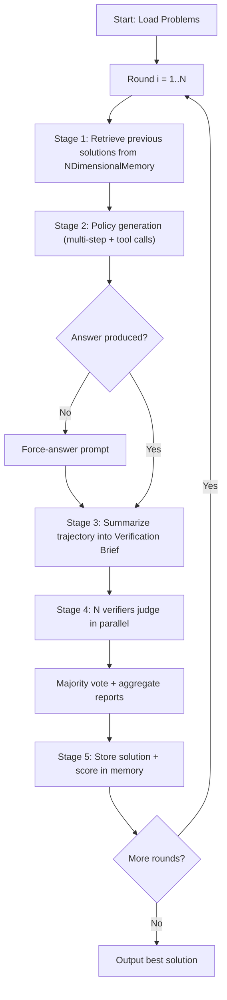

# Self-Evolution

AlphaApollo's **self-evolution** system enables iterative, multi-round problem solving where an agent progressively refines its solutions. In each evolution round, a *policy* model generates a candidate solution, a *summarizer* distills the trajectory, and one or more *verifiers* judge correctness. Results are stored in a shared memory, allowing subsequent rounds to learn from past attempts.

## How It Works

The evolution loop follows a four-stage pipeline repeated for `evolving_round` iterations:

```text
┌─────────────────────────────────────────────────────────┐
│                    Evolution Round                      │
│                                                         │
│  1. Retrieve previous solutions from memory             │
│                         ↓                               │
│  2. Policy Stage: multi-step generation + tool calls    │
│                         ↓                               │
│  3. Summarization: condense trajectory into brief       │
│                         ↓                               │
│  4. Verifier Stage: N parallel verifiers → vote → merge │
│                         ↓                               │
│  5. Store result (solution + score) in memory           │
└─────────────────────────────────────────────────────────┘
```



Each round builds on prior attempts — the model sees its best previous solutions and can either extend, correct, or take an entirely new approach.

## Single-Model Evolution

Entry point: `alphaapollo/core/generation/evolving/evolving_main.py`

### The `run_problem()` Flow

For each problem, the system:

1. **Creates an `NDimensionalMemory`** (`solution_memory`) that persists across all rounds.
2. **Runs the evolving loop** for `evolving_round` iterations:

#### Stage 1 — Previous Solutions

Retrieves top-performing prior solutions from `solution_memory` and injects them into the prompt via the `WITH_PREVIOUS_SOLUTIONS` template variant.

#### Stage 2 — Policy Generation

- Resets the environment with the problem (question + ground truth).
- Enters a multi-step loop where the policy model generates actions, the environment executes tool calls (e.g., `python_code`, `local_rag`), and returns observations.
- If the model hasn't produced an `<answer>` by the final step, a **force-answer** prompt is used to elicit a final answer.
- Actions are collected via `collect_actions_from_gpt()` (sequential or parallel).

#### Stage 3 — Summarization

An LLM agent condenses the full policy trajectory into a concise **Verification Brief** using `SUMMARIZER_TEMPLATE`. This brief is what verifiers receive instead of the raw multi-step trace.

#### Stage 4 — Verification

- **N verifiers** run in parallel, each independently evaluating the policy solution.
- Each verifier outputs a `<report>` containing a judgment (`\boxed{1}` for correct, `\boxed{0}` for incorrect).
- **Majority voting** determines the final verdict.
- An **aggregation step** (`VERIFIER_REPORT_AGGREGATION_TEMPLATE`) merges individual reports into a unified explanation.
- `ensure_verifier_format()` retries if a verifier's output doesn't match the expected format.

#### Stage 5 — Memory Update

The policy solution, verifier report, and computed score are stored in `solution_memory`. The memory's N-dimensional sorting ensures that high-quality solutions surface in future rounds.

### Key Helper Functions

| Function | Purpose |
| --- | --- |
| `extract_tag_block(text, tag)` | Extracts content within `<tag>...</tag>` |
| `extract_boxed_answer(text)` | Extracts `\boxed{...}` answers |
| `compute_answer_correctness()` | Compares extracted answer against ground truth |
| `ensure_verifier_format()` | Validates and retries verifier output format (up to `max_retries=5`) |
| `aggregate_verifier_judgments()` | Majority voting + LLM report aggregation |
| `policy_repeat_sampling()` | Retries policy generation on format violations (up to `max_retries=5`) |
| `verifier_repeat_sampling()` | Retries verifier generation on format violations (up to `max_retries=5`) |
| `verifier_repeat_sampling_single()` | Single-threaded variant of verifier retry |
| `verifier_repeat_sampling_parallel()` | Multi-threaded variant for parallel verifier sampling |
| `collect_actions_from_gpt()` | Sequential action collection from the LLM |
| `collect_actions_from_gpt_parallel()` | Parallel action collection using `ThreadPoolExecutor` |
| `load_problems()` | Loads problem set from parquet files |
| `run_problems_parallel()` | Runs multiple problems concurrently |

## Multi-Model K-Branch Evolution

Entry point: `alphaapollo/core/generation/evolving/evolving_multi_models.py`

The multi-model variant extends single-model evolution by running **K independent branches in parallel**, each with its own policy and verifier models, while sharing a common solution memory.

### Architecture

```text
                    ┌── Branch 1 (Policy A + Verifier X) ──┐
                    │                                      │
Shared Memory  ←──  ├── Branch 2 (Policy B + Verifier Y) ──┤  ←── Shared Memory
                    │                                      │
                    └── Branch 3 (Policy C + Verifier Z) ──┘
```

### Key Components

- **`ThreadSafeSolutionMemory`** — A thread-safe wrapper around `NDimensionalMemory` that allows concurrent read/write from multiple branches.
- **`BranchConfig`** — Configuration for a single branch: `branch_id`, `policy_agent`, `verifier_agent`.
- **`BranchResult`** — Contains the output of a branch execution (solution, score, verifier report).

### How It Differs

| Aspect | Single-Model | Multi-Model K-Branch |
| --- | --- | --- |
| Models | 1 policy + 1 verifier | K policy + K verifier (heterogeneous) |
| Execution | Sequential rounds | Parallel branches per round |
| Memory | `NDimensionalMemory` | `ThreadSafeSolutionMemory` (shared) |
| Config | `policy_model_cfg` + `verifier_cfg` | `branches[]` list with per-branch configs |
| Concurrency | Per-verifier parallelism | `branch_max_workers` for branch-level parallelism |

The diversity of models across branches increases solution coverage — different models may excel at different reasoning strategies.

## Agent Client

`alphaapollo/core/generation/evolving/utils/agent.py` provides the `Agent` class, an OpenAI-compatible LLM client used throughout the evolution pipeline:

- Wraps the OpenAI Chat Completions API with `max_retries=5` and `timeout=300s`.
- `get_action_from_gpt(obs)` — sends the observation as a user message, handles `reasoning_content` (for reasoning models like QwQ, o1, etc.), and returns the response formatted as `<think>...\n</think>\n{content}`.
- Configurable: `system_prompt`, `temperature`, `max_tokens`, `model`, `base_url`.

:::warning Two Agent classes
AlphaApollo contains a **separate, simpler `Agent`** class in `core/tools/agent.py` that lacks retry logic, timeout configuration, and `reasoning_content` handling. That class is used for tool-level verification calls, not for the evolution pipeline. See [Tools — Agent Client](./tools.md#agent-client) for the comparison.
:::

## Evolving Environment

The evolving environment (`alphaapollo/core/environments/informal_math_evolving/`) mirrors the training environment but adds evolution-specific features:

- **`<report>` tag** — an additional termination signal used by verifiers (highest priority in projection).
- **`done_reason`** — tracks why an episode ended (max steps, answer given, report submitted, empty action).
- **`policy_solution`** — stores the policy's solution for the verifier to evaluate.
- **`previous_solutions`** — prior attempts from memory, injected into the prompt.
- **Force-done logic** — automatically terminates on empty actions to prevent infinite loops.

## Configuration

### Single-Model Evolution

Config file: `examples/configs/vllm_informal_math.yaml`

Key parameters:

```yaml
run:
  evolving_round: 10      # Number of evolution iterations
  test_times: 1            # Verifier repetitions per round

env:
  config:
    max_steps: 4           # Max tool-call steps per round
    history_length: 4      # Memory entries shown to model
    memory_type: simple    # Memory type: simple | score | ndimensional
    enable_python_code: true

policy_model_cfg:
  model_name: "your-policy-model"
  base_url: "http://localhost:9876/v1"
  temperature: 0.6
  max_tokens: 16384

verifier_cfg:
  model_name: "your-verifier-model"
  base_url: "http://localhost:9877/v1"
  temperature: 0.6
```

### Multi-Model K-Branch Evolution

Config file: `examples/configs/vllm_informal_math_multi_models.yaml`

Additional parameters:

```yaml
branches:
  - branch_id: "branch_1"
    policy_model_cfg:
      model_name: "model-a"
      base_url: "http://localhost:9876/v1"
    verifier_cfg:
      model_name: "verifier-a"
      base_url: "http://localhost:9877/v1"
  - branch_id: "branch_2"
    policy_model_cfg:
      model_name: "model-b"
      base_url: "http://localhost:9878/v1"
    # Uses default_verifier_cfg if not specified

default_verifier_cfg:
  model_name: "shared-verifier"
  base_url: "http://localhost:9877/v1"

branch_max_workers: 2  # Parallel branch execution
```

## Running Evolution

### Prerequisites

Serve the required models before running evolution:

```bash
python alphaapollo/utils/ray_serve_llm.py \
  --model_path Qwen/Qwen3-4B-Instruct-2507 \
  --gpus "0,1" \
  --port 8000 \
  --model_id "qwen3_4b_inst"
```

### Method 1: one-line workflow entrypoint

```python
# single-model evolution
python3 -m alphaapollo.workflows.evo \
  --preprocess.data_source=math-ai/aime24 \
  --run.dataset_name=aime24 \
  --policy_model_cfg.model_name=qwen3_4b_inst \
  --policy_model_cfg.base_url=http://localhost:8000/v1 \
  --verifier_cfg.model_name=qwen3_4b_inst \
  --verifier_cfg.base_url=http://localhost:8000/v1
```

### Method 2: script entrypoints

```bash
bash examples/evo/run_evo_informal_math.sh
bash examples/evo/run_evo_informal_math_multi_models.sh
```
Both methods first run the data preprocessing step (`prepare_evolving_data`) and then launch the evolution loop.
