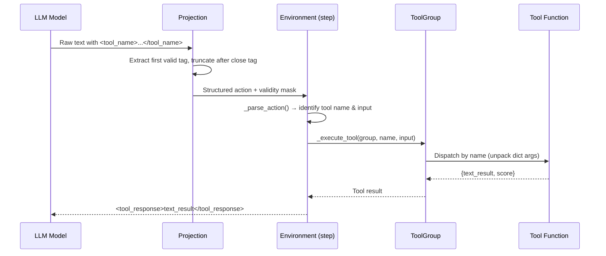

# Tools

AlphaApollo includes an extensible tool system that allows models to execute actions in the real world — running code and retrieving knowledge. The tool framework is built around a **descriptor-based registration pattern**, and ships with three built-in tools: **Python Code** and **Local RAG**.

## Tool Framework

The framework is defined in `alphaapollo/core/tools/core.py` and provides two core abstractions:

### `tool` Descriptor

The `tool` class is a Python [descriptor](https://docs.python.org/3/howto/descriptor.html) that marks a method as a callable tool. When applied via the `@tool` decorator syntax, it stores the method’s `__name__` as the tool name and supports automatic discovery by `ToolGroup`:

```python
from alphaapollo.core.tools.core import tool

class MyToolGroup(ToolGroup):
    @tool
    def my_tool(self, input_text: str) -> dict:
        return {"text_result": "...", "score": 0}
```

:::info Implementation note
Unlike a simple function decorator, `tool` implements `__init__` and `__get__` — making it a descriptor rather than a wrapper. `ToolGroup._register_tools()` identifies tool methods by checking `isinstance(attr, tool)` on the class, not the instance.
:::

### `ToolGroup` Base Class

A container for related tools:

| Method | Description |
| --- | --- |
| `__init__(name)` | Stores the group name and calls `_register_tools()` |
| `_register_tools()` | Auto-discovers all `@tool`-decorated methods on the class |
| `get_name()` | Returns the group’s name |
| `get_tool(name)` | Returns the callable for a single tool, or `None` if not found |
| `get_tool_names()` | Returns a list of all registered tool names |
| `execute_tool(name, *args, **kwargs)` | Dispatches a call to the named tool. If a single `dict` argument is passed, it is unpacked as `**kwargs` |
| `get_tool_to_group_mapping()` | Returns a `{tool_name: group_name}` mapping |

### InformalMathToolGroup

`alphaapollo/core/tools/manager.py` implements `InformalMathToolGroup(ToolGroup)`, which registers the three built-in tools:

```python
class InformalMathToolGroup(ToolGroup):
    def __init__(self, log_requests=True, vllm_cfg=None,
                 verifier_cfg=None, tool_config=None, rag_cfg=None): ...

    @tool
    def python_code(self, code: str) -> dict: ...

    @tool
    def local_rag(self, repo_name: str, query: str, top_k: int) -> dict: ...
```

**Constructor parameters:**

| Parameter | Type | Description |
| --- | --- | --- |
| `log_requests` | `bool` | Whether to log tool invocations (default: `True`) |
| `vllm_cfg` | `dict` | Deprecated — use `verifier_cfg` instead |
| `verifier_cfg` | `dict` | Configuration for the verifier agent (model name, base URL, etc.) |
| `tool_config` | `dict` | Controls tool behavior (see below) |
| `rag_cfg` | `dict` | RAG-specific configuration (overrides `tool_config["rag_cfg"]`) |

**`tool_config` keys:**

| Key | Type | Default | Description |
| --- | --- | --- | --- |
| `enable_python_code` | `bool` | `True` | Enable/disable Python code execution |
| `enable_local_rag` | `bool` | `True` | Enable/disable Local RAG retrieval |
| `python_code_timeout` | `int` | `30` | Timeout in seconds for code execution (at the ToolGroup level) |
| `rag_cfg` | `dict` | `{}` | RAG connection settings (see [RAG Infrastructure](#rag-infrastructure)) |

**Instance methods:**

- `set_ground_truth(ground_truth: str)` — the environment calls this on each `reset()` to inject the current problem’s answer.

## Python Code Tool

**File**: `alphaapollo/core/tools/python_code.py`

The Python Code tool allows the model to write and execute Python code during reasoning, enabling numerical computation, symbolic manipulation, and verification.

### How It Works

1. **Security check** — `check_forbidden_imports()` blocks dangerous modules:
   - `subprocess`, `multiprocessing`, `threading`, `socket`, `psutil`, `resource`, `ctypes`
   - Builtins: `input()`
2. **Code wrapping** — `wrap_python_code()` automatically adds `print()` around the last expression if it doesn't already produce output.
3. **f-string fix** — escapes literal newlines inside f-strings, which is a common issue in LLM-generated code.
4. **Indentation fix** — `fix_indentation()` corrects common indentation issues in LLM-generated code.
4. **Execution** — writes the code to a temporary file and runs it via `subprocess.run()` with configurable timeout.
5. **Pre-imports** — common libraries are pre-imported: `string`, `re`, `datetime`, `collections`, `heapq`, `bisect`, `copy`, `math`, `random`, `statistics`, `itertools`, `functools`, `operator`, `io`, `sys`, `json`, `builtins`, `typing`.

### Return Value

The low-level `execute_python_code()` function returns:

```python
{
    "stdout": "...",          # Standard output
    "stderr": "...",          # Standard error
    "returncode": 0,          # Exit code
    "run_status": "Finished"  # "Finished" | "Timeout" | "Error"
}
```

The `@tool python_code()` wrapper then re-packages this into the standard tool format:

```python
{
    "text_result": "{\"result\": \"...\", \"status\": \"success\", ...}",  # JSON string
    "score": 1       # 1 if "Finished", 0 otherwise
}
```

:::note Two timeout defaults
The raw `execute_python_code()` uses `DEFAULT_TIMEOUT = 3` seconds (in `python_code.py`), but `InformalMathToolGroup` defaults to `python_code_timeout = 30` seconds (in `manager.py`). The ToolGroup’s value takes precedence at runtime.
:::

### Tool Invocation Format

The model uses XML-style tags to invoke this tool:

```xml
<python_code>
import sympy
x = sympy.Symbol('x')
print(sympy.solve(x**2 - 4, x))
</python_code>
```

## Local RAG Tool

**File**: `alphaapollo/core/tools/rag/local_rag.py`

The Local RAG (Retrieval-Augmented Generation) tool allows the model to search documentation from mathematical and scientific Python libraries. For architecture and configuration context, see [Agent System](./agent-system.md) and [Evolving Config](../configuration/evolving.md).

### Supported Repositories

| Repository | Domain |
| --- | --- |
| `sympy` | Symbolic mathematics |
| `scipy` | Scientific computing |
| `numpy` | Numerical computing |
| `math` | Standard math library |
| `cmath` | Complex math |
| `fractions` | Rational arithmetic |
| `itertools` | Combinatorial iterators |

### Retrieval Flow

```text
Query → Rewrite (generalize/simplify)
          ↓
     RAG Retrieve (embedding search)
          ↓
     Summarize (distill relevant info)
          ↓
     Return results
```

1. **Query rewriting** — `rewrite_to_single_or_empty()` generalizes the query for better retrieval. If the query is already simple, it returns empty (skip rewriting).
2. **Retrieval** — `rag_retrieve()` calls the RAG API endpoint (`/rag/retrieve`) with the rewritten query and returns top-*k* document chunks.
3. **Summarization** — `summarize_or_empty()` condenses retrieved documents into a focused answer. If documents are already clear, returns empty (skip summarization).

### RAG Infrastructure

The RAG system consists of three services:

| Service | Default Port | Purpose |
| --- | --- | --- |
| vLLM Chat | 10089 | Query rewriting & summarization |
| vLLM Embed | 10088 | Embedding generation |
| RAG API | 10086 | Document retrieval |

Configuration is managed in `alphaapollo/core/tools/rag/rag_config.yaml`. The `InformalMathToolGroup.local_rag()` method reads connection settings from `rag_cfg` as full URLs:

| `rag_cfg` Key | Description | Example |
| --- | --- | --- |
| `rag_base_url` | RAG retrieval API endpoint | `http://localhost:10086` |
| `chat_base_url` | vLLM chat API endpoint | `http://localhost:10089/v1` |
| `chat_model` | Model name for rewriting/summarization | `Qwen/Qwen2.5-7B` |
| `chat_timeout` | Timeout for chat requests | `60` |

:::tip RAG file structure
The `alphaapollo/core/tools/rag/` directory contains:
- `local_rag.py` — retrieval + rewriting + summarization pipeline
- `rag_utils.py` — shared RAG utilities  
- `rag_config.py` / `rag_config.yaml` — default configuration
- `start_rag_server.sh` / `stop_rag_server.sh` — server lifecycle scripts
- `deepwiki_server/` — RAG server implementation
:::

See [Evolving Config](../configuration/evolving.md) for setup-related configuration details.

### RAG Service Setup

Use the following steps to set up Local RAG services.

#### 1) Install dependencies

```bash
pip install -r alphaapollo/core/tools/rag/requirements.txt
```

#### 2) Prepare DeepWiki cache

```bash
mkdir -p ~/.adalflow
```

If you have pre-existing cache data, extract it to `~/.adalflow`.

DeepWiki cache archive:
`https://drive.google.com/file/d/1QnORK_1Qcjstm4_DnrbIUX_rPd-AiGEx/view?usp=sharing`

Or download with `gdown`:

```bash
cd ~/.adalflow
# pip install gdown
gdown https://drive.google.com/uc?id=1QnORK_1Qcjstm4_DnrbIUX_rPd-AiGEx
```

```bash
unzip deepwiki_data.zip -d ~/.adalflow
# verify: should contain 'databases' and 'wikicache'
ls ~/.adalflow
```

#### 3) Edit RAG config

Edit `alphaapollo/core/tools/rag/rag_config.yaml`:

```yaml
ports:
  rag_api: 10086
  vllm_embed: 10088
  vllm_chat: 10089

models:
  chat:
    path: "/path/to/Qwen3-8B"
    max_model_len: 32768
    gpu_memory_utilization: 0.6
  embedding:
    path: "/path/to/Qwen3-Embedding-8B"

gpu:
  cuda_visible_devices: "5"
```

#### 4) Start services

```bash
bash alphaapollo/core/tools/rag/start_rag_server.sh
```

This starts:
1. vLLM Chat (10089)
2. vLLM Embed (10088)
3. RAG API (10086)

#### 5) Run a quick test

```bash
python -m alphaapollo.core.tools.rag.rag_test
```

#### 6) Stop services

```bash
bash alphaapollo/core/tools/rag/stop_rag_server.sh
```

#### 7) View logs

```bash
tail -f alphaapollo/core/tools/rag/logs/vllm_chat.log
tail -f alphaapollo/core/tools/rag/logs/vllm_embed.log
tail -f alphaapollo/core/tools/rag/logs/rag_api.log
```

### Tool Invocation Format

```xml
<local_rag>
repo_name: sympy
query: How to solve a system of linear equations?
top_k: 5
</local_rag>
```

## How Tools Are Called

The environment's action parsing and tool execution flow:



Detailed steps:

1. The model generates text containing tool-call tags (e.g., `<python_code>...</python_code>`).
2. **Projection** (`projection.py`) extracts the first valid tool call and truncates after the closing tag.
3. The environment's `step()` method invokes `_parse_action()` to identify the tool name and input.
4. `_execute_tool()` dispatches the call to the appropriate `ToolGroup` method.
5. The tool result (text + score) is returned as part of the observation.

Tool call priority: `<answer>` (terminates) > tool tags. If both appear in the same action, the action is marked invalid.

## Adding Custom Tools

For a complete step-by-step guide on adding custom tools — including implementation, registration, projection, prompt updates, configuration, and testing — see [new-tool.md](../contribution/new-tool.md).

## Agent Client

AlphaApollo includes **two `Agent` classes** that serve as OpenAI-compatible LLM clients:

| Agent | Location | Use Case |
| --- | --- | --- |
| `core/tools/agent.py` | Tool-level | Simple inference without retry/timeout; used for tool-based verification |
| `generation/evolving/utils/agent.py` | Evolution pipeline | Full-featured: `max_retries=5`, `timeout=300s`, handles `reasoning_content` from reasoning models |

The evolution `Agent` formats reasoning models’ output as `<think>...\n</think>\n{content}`, while the tool-level `Agent` returns raw content only.

## Configuration

Tools are enabled/disabled through the environment config in YAML files:

```yaml
env:
  config:
    enable_python_code: true
    enable_local_rag: false
    python_code_timeout: 30
    rag_cfg:
      rag_base_url: "http://localhost:10086"
      chat_base_url: "http://localhost:10089/v1"
      chat_model: "Qwen/Qwen2.5-7B"
      chat_timeout: 60
```

The `InformalMathToolGroup` reads these flags at initialization and only registers enabled tools.

## Security Model

The Python Code tool enforces a security sandbox via `check_forbidden_imports()`:

| Blocked Module | Reason |
| --- | --- |
| `subprocess` | Prevents arbitrary command execution |
| `multiprocessing` | Prevents process forking |
| `threading` | Prevents thread spawning |
| `socket` | Prevents network access |
| `psutil` | Prevents system introspection |
| `resource` | Prevents resource limit manipulation |
| `ctypes` | Prevents FFI / native code execution |
| `input()` builtin | Prevents stdin blocking |

Code is executed in a temporary file via `subprocess.run()` with a configurable timeout, providing process-level isolation.

## Troubleshooting

| Symptom | Cause | Fix |
| --- | --- | --- |
| `Tool 'X' not found in group 'Y'` | Tool method name doesn’t match the XML tag | Ensure `@tool` method name equals the tag name exactly |
| `Timeout` from `python_code` | Code runs longer than `python_code_timeout` | Increase timeout in YAML config or optimize the generated code |
| `Forbidden import detected` | Code uses a blocked module | Review generated code; this is expected security behavior |
| RAG returns empty results | RAG services not running | Start services with `bash alphaapollo/core/tools/rag/start_rag_server.sh` |
| `Connection refused` on RAG | Wrong `rag_base_url` or `chat_base_url` | Verify URLs and ports in `rag_cfg` match the running services |

